Data visualization in R
================

> ## Learning Objectives
> 
>   - Produce scatterplots, boxplots, and histograms summarizing the
>     Spotify data.
>   - Learn about universal and local plot settings.
>   - Use faceting effectively in ggplot2

First, lets load the packages and data we’ll need. If your R session is
still open from the Data Manipulation session, you don’t need to do
this.

`ggplot2` is included in the tidyverse

``` r
library(tidyverse)
```

``` r
spotify <- read_csv("data/spotify.csv")
```

    ## Parsed with column specification:
    ## cols(
    ##   genre = col_character(),
    ##   energy = col_double(),
    ##   loudness = col_double(),
    ##   tempo = col_double(),
    ##   danceability = col_double(),
    ##   lyrics = col_character()
    ## )

## Plotting with ggplot2

`ggplot2` is a plotting package that makes it simple to create complex
plots from data in a data frame. It provides a more programmatic
interface for specifying what variables to plot, how they are displayed,
and general visual properties. Therefore, we only need minimal changes
if the underlying data change or if we decide to change from a bar plot
to a scatter plot. This helps in creating publication quality plots with
minimal amounts of adjustments and tweaking.

`ggplot2` functions like tidy data. Well-structured data will save you
lots of time when making figures with ggplot2

`ggplot2` graphics are built step by step by adding new elements. Adding
layers in this fashion allows for extensive flexibility and
customization of plots.

To build a `ggplot`, we will use the following basic template that can
be used for different types of plots:

``` r
ggplot(data = < DATA > , aes( < MAPPINGS > )) +  geom_FUNCTION()
```

**data**  
Bind the plot to a specific data frame using the `data` argument

**aes()**  
Use the `aes()` (aesthetics) function to select the variables to be
plotted and specify how to present them in the graph, e.g. as x/y
positions or characteristics such as size, shape, color, etc.

**geom**  
Add ‘geoms’ – graphical representations of the data in the plot (points,
lines, bars). Some examples that you will use today:

  - `geom_point()` for scatter plots, dot plots, etc.
  - `geom_smooth()` for trendlines
  - `geom_boxplot()` for boxplots
  - `geom_histogram()` for histograms

To add a geom to the plot use the `+` operator. This is somewhat similar
to `%>%`. I allows you to be modular with your plots.

Lets get our hands dirty and make a quick scatterplot

``` r
ggplot(data = spotify, aes(x = energy, y = loudness)) +
  geom_point()
```

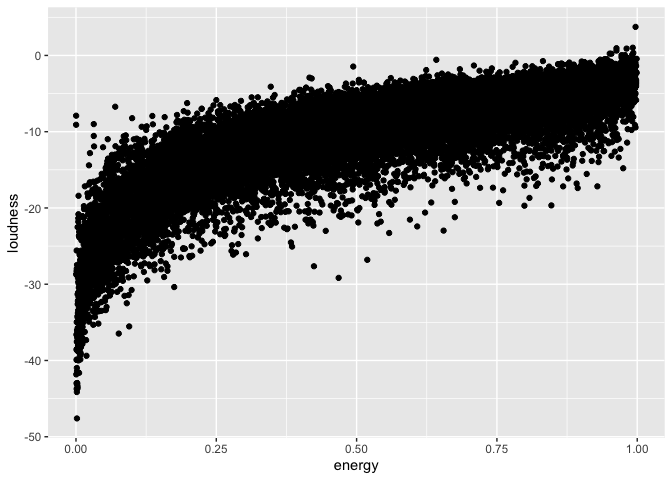<!-- -->

It looks like song energy and loundness have a positive relationship\!

The `+` operator can really come in handy. It allows you to modify
existing `ggplot` objects. That way you can set up plot templates and
explore different types of plots without having to reinvent the wheel.

Here’s an example:

``` r
# Assign a plot to an object. This is your template
energy_loudness <- ggplot(data = spotify, aes(x = energy, y = loudness))

# draw the plot. this will return the same plot as above
energy_loudness +
  geom_point()
```

<!-- -->

Now, if you want to just draw a trendline without points, you can\!

``` r
energy_loudness +
  geom_smooth()
```

    ## `geom_smooth()` using method = 'gam' and formula 'y ~ s(x, bs = "cs")'

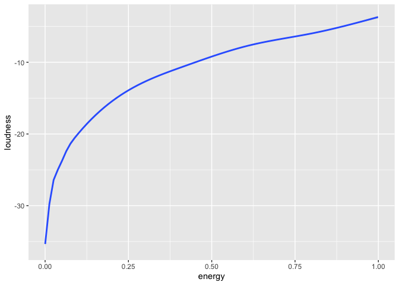<!-- -->

Anything you put in the `ggplot()` function can be seen by any geom
layers that you add (i.e., these are universal plot settings). This
includes the x- and y-axis mapping you set up in aes(). You can also
specify mappings for a given geom independently of the mappings defined
globally in the `ggplot()` function.

**Exercise 1**

Create the same scatterplot as above (`geom_point()`), but define the x
variable as energy and the y variable as tempo. What kind of trend do
you see?

## Building plots iteratively

Usually it takes some experimentation to get a plot looking just right.
`ggplot` makes it easy to iteratively build your plot.

Let’s return to the scatterplot of energy and loudness:

``` r
ggplot(data = spotify, aes(x = energy, y = loudness)) +
  geom_point()
```

<!-- -->

There are a ton of points on the plot. You can avoid overplotting by
adjusting the transparency of the points with the `alpha` parameter,
which you supply to the `geom_point()` function. Feel free to play
around with the `alpha` parameter. It ranges from 0 to 1, with 1 being
the most opaque.

``` r
ggplot(data = spotify, aes(x = energy, y = loudness)) +
  geom_point(alpha = 0.2)
```

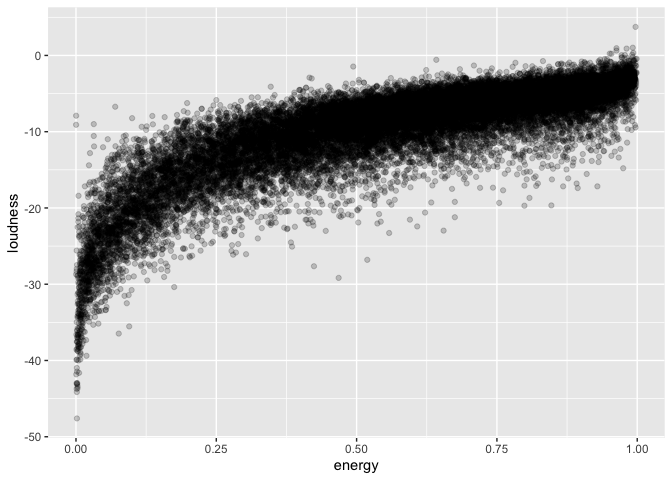<!-- -->

Interesting. The point density gets denser as the two variables
increase. Le’ts see if there may be some effects of `genre` on this
relationship. We do this by supplying `genre` to the `color` aesthetic.

``` r
ggplot(data = spotify, aes(x = energy, y = loudness, color = genre)) +
  geom_point(alpha = 0.2)
```

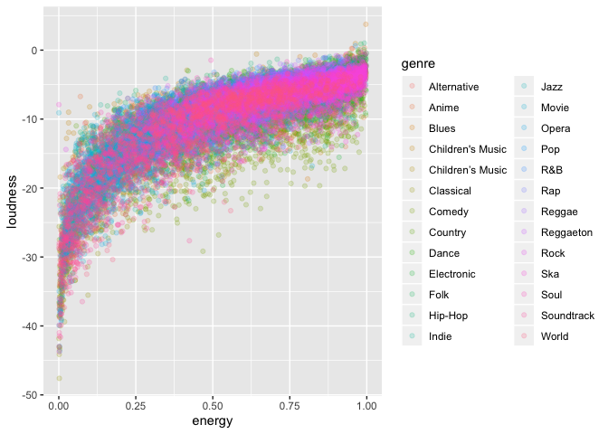<!-- -->

Woah buddy, that’s a lot of colors\! Lets use our data filtering skills
to reduce the data set to a more manageable five genres. Lets go with
Folk, Rock, Soul, Rap, and Pop.

``` r
spotify_filtered <- spotify %>% 
  filter(genre == "Folk" | genre == "Rock" | genre == "Soul" | genre == "Rap" | genre == "Pop")
```

Let’s make the same scatterplot as before, but use this reduced data
set. There are going to be fewer data points on the graph, so we can
raise the value of alpha.

``` r
ggplot(data = spotify_filtered, aes(x = energy, y = loudness, color = genre)) +
  geom_point(alpha = 0.8)
```

<!-- -->

It looks like there aren’t differences in the relationship between
energy and loudness across genera, at least for the genera we’re working
with.

**Exercise 2**

Let’s take one last effort to see if there are differences in the
relationship between energy and loudness across groups. Rather than
plotting the full scatterplot, plot the trendlines with the
`geom_smooth()` function.

-----

## Boxplots

What if you’re interested in the differences in the distribution of a
single variable across genera? Boxplots help you do that.

Here is a quick look at how the distribution of danceability differs
across genera.

``` r
bp <- ggplot(data = spotify_filtered, aes(x = genre, y = danceability))

bp +
  geom_boxplot()
```

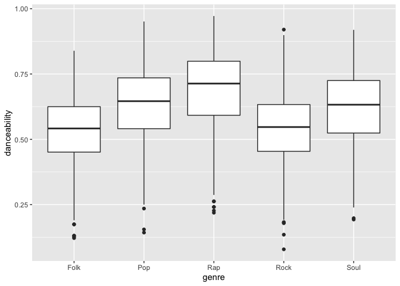<!-- -->

It looks like Pop, Rap, and Soul are the most danceable genera, but Folk
and Rock aren’t so much.

[Boxplots](https://www.r-graph-gallery.com/boxplot) are great for
general trends, but they don’t represent the distribution of the data
super well. [Violin plots](https://www.r-graph-gallery.com/violin) do a
better job of this. Since you saved the last `ggplot` object as `bp`,
you don’t have to rewrite the long `ggplot` call again\!

``` r
bp +
  geom_violin()
```

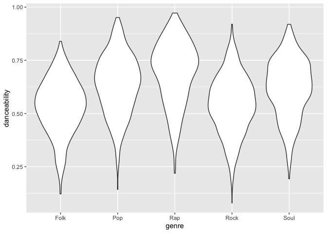<!-- -->

The distributions look unimodal, with some skew. This looks fine to me\!

## Customization

The data visualizations so far convey patterns in the data well enough,
but they lack refinement. Let’s spruce a plot up to make it more
professional.

First, I’m going to introduce the `geom_histogram()` function, which
will allow you to visualize the distribution of a single variable.

Let’s take a look at danceability. Since you’re only visualizing one
variable, you only need to supply an argument to the `x` aesthetic.

``` r
ggplot(data = spotify_filtered, aes(x = danceability)) +
  geom_histogram()
```

    ## `stat_bin()` using `bins = 30`. Pick better value with `binwidth`.

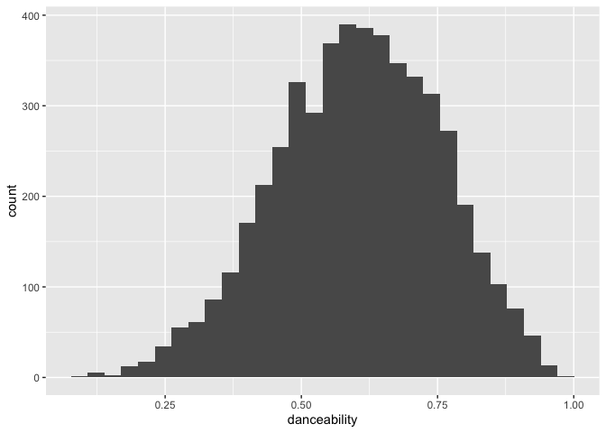<!-- -->

First we need to fix that notification. Picking binwidths is a tricky
endeavor which can bias the representation of your distribution. For
simplicity, let’s just pick the number of bins as 40.

``` r
ggplot(data = spotify_filtered, aes(x = danceability)) +
  geom_histogram(bins = 40)
```

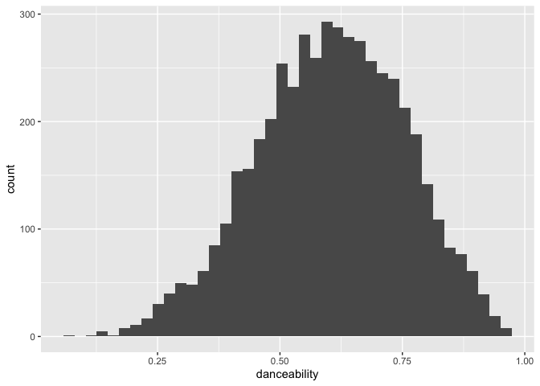<!-- -->

Now, let’s fix the axis labels. Capitalizing the first letter should do
the trick\! While we’re add it, let’s add an informative title. We can
do all of this with the `labs()` function.

``` r
ggplot(data = spotify_filtered, aes(x = danceability)) +
  geom_histogram(bins = 40)  +
  labs(title = "Danceability of my favorite genera",
       x = "Danceability",
       y = "Count")
```

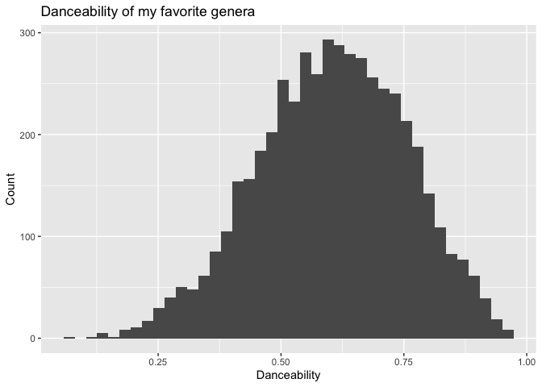<!-- -->

This is already looking better\! The gray background isn’t very
pleasing, though. To remove this, the `theme()` function will work, but
it can be a headache to tweak everything just the way you want it. See
[here](https://ggplot2.tidyverse.org/reference/theme.html) for the
insane list of options. Fortunately, `ggplot` comes prepackaged with [a
set of themes](https://ggplot2.tidyverse.org/reference/ggtheme.html)
where most of the decisions are made for you. There are a few to choose
from, but I’m going to make an executive decision and pick one of my
favorites, `theme_minimal()`.

``` r
ggplot(data = spotify_filtered, aes(x = danceability)) +
  geom_histogram(bins = 40)  +
  labs(title = "Danceability of my favorite genera",
       x = "Danceability",
       y = "Count") +
  theme_minimal()
```

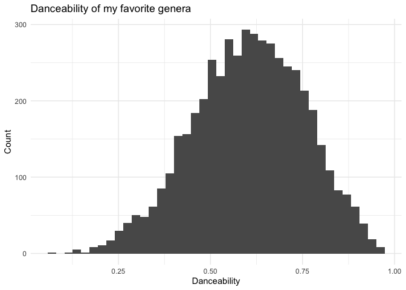<!-- -->

This looks almost publishable\! The font sizes could use a little
tweaking and I’m sure there are more interesting colors you can think
of, but this is pretty good for a few lines of code\!

**Exercise 3**

Try making a histogram like this yourself\! Pick your favorite numeric
variable from the `spotify_filtered` data set and either replicate the
above plot or tweak it and have some fun.

-----

## Faceting

`ggplot2` has a special technique called faceting that allows the user
to split one plot into multiple plots based on a factor included in the
dataset.

There are two types of facet functions:

  - `facet_wrap()` arranges a one-dimensional sequence of panels to
    allow them to cleanly fit on one page.
  - `facet_grid()` allows you to form a matrix of rows and columns of
    panels.

The spotify data set doesn’t lend itself well to `facet_grid`, so we’re
going to stick with `facet_wrap`.

To use `facet_wrap`, you need to supply it with the variable you want
the plots to be separated into. The variable needs to be wrapped in the
`vars()` function, which tells `facet_wrap` that this is a variable from
the data set being used to plot. A complete function looks like this:
`facet_wrap(facets = vars(genre))`.

You’re now going to take the pretty histogram you made earlier and split
it up according to the genera.

``` r
ggplot(data = spotify_filtered, aes(x = danceability)) +
  geom_histogram(bins = 40)  +
  labs(title = "Danceability of my favorite genera",
       x = "Danceability",
       y = "Count") +
  theme_minimal() +
  facet_wrap(facets = vars(genre))
```

<!-- -->

Nice\! We can see that Rap, Pop, and Soul are a little skewed towards
higher Danceability values.

**Exercise 4**

Can you try this with the filtered scatter plot?

Here’s the original code:

``` r
ggplot(data = spotify_filtered, aes(x = energy, y = loudness, color = genre)) +
  geom_point(alpha = 0.8)
```

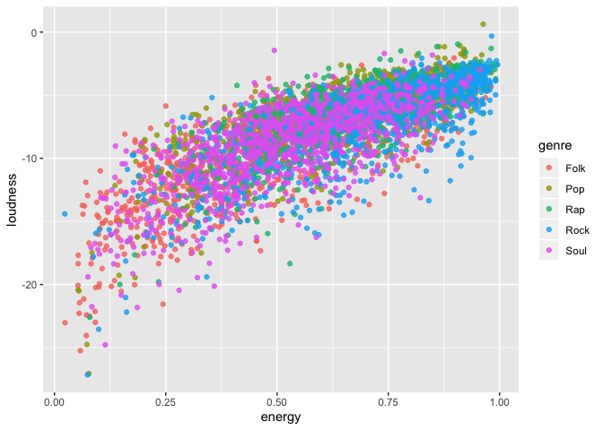<!-- -->

See if you can spruce the plot up a bit first, like we did with the
histogram\!

*Extension* If we have time, do this same faceted plot, but with
`geom_smooth` rather than `geom_point`

## Answers

**Exercise 1**

Doesn’t look like there is a strong trend\! Maybe slightly positive.

``` r
ggplot(data = spotify, aes(x = energy, y = tempo)) +
  geom_point()
```

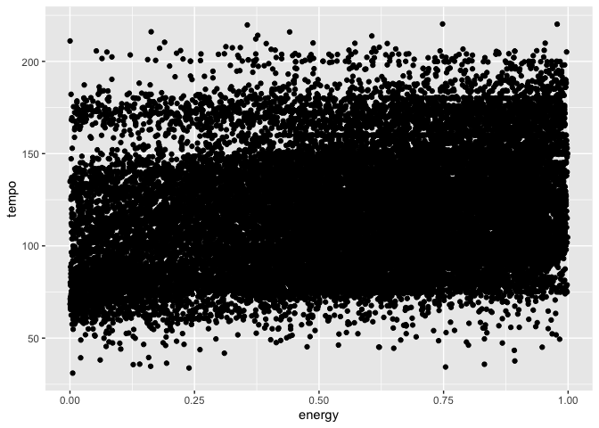<!-- -->

**Exercise 2**

Looks like there is still no difference in the relationship across
genera\!

``` r
ggplot(data = spotify_filtered, aes(x = energy, y = loudness, color = genre)) +
  geom_smooth()
```

    ## `geom_smooth()` using method = 'gam' and formula 'y ~ s(x, bs = "cs")'

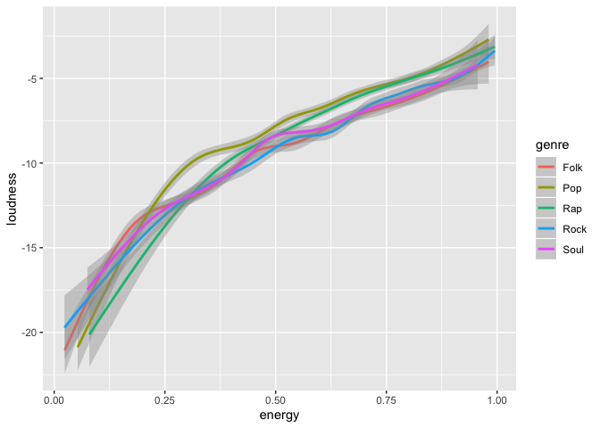<!-- -->

**Exercise 3** There’s really no right answer to this. Have some fun\!

**Exercise 4**

Here is one example of a faceted scatterplot:

``` r
ggplot(data = spotify_filtered, aes(x = energy, y = loudness, color = genre)) +
  geom_point(alpha = 0.8) +
  facet_wrap(facets = vars(genre))
```

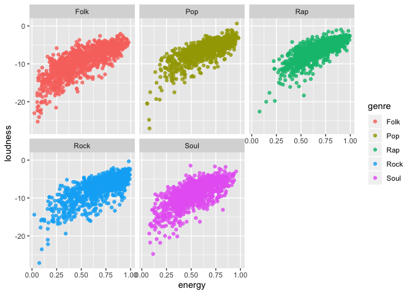<!-- -->

Here are faceted trendlines:

``` r
ggplot(data = spotify_filtered, aes(x = energy, y = loudness, color = genre)) +
  geom_smooth() +
  facet_wrap(facets = vars(genre))
```

    ## `geom_smooth()` using method = 'gam' and formula 'y ~ s(x, bs = "cs")'

<!-- -->

## Resources

There are many good data visualization resources to check out\! Here are
some of my favorites.

[Fundamentals of Data Visualization](https://serialmentor.com/dataviz/)

[R for Data Science](https://r4ds.had.co.nz/data-visualisation.html)

[From data to viz](https://www.data-to-viz.com/)
